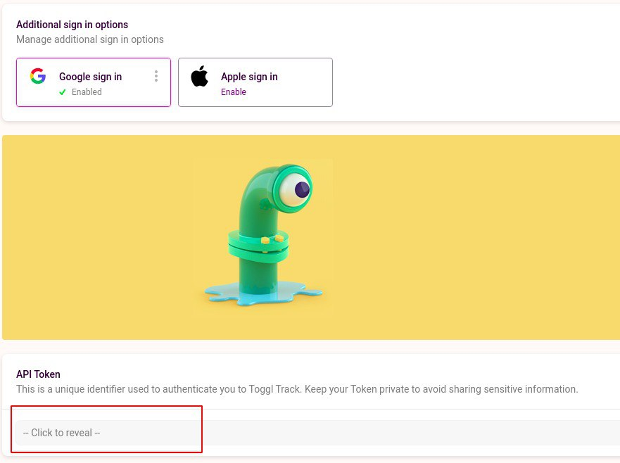

# [WIP] toggl 2 csv

A ideia desse projeto é agilizar a criação das planilhas através da utilização do [Toggl](https://track.toggl.com) em conjunto com esse script

## O que você vai precisar para rodar esse projeto?

-   Python 3.8+

`Nota:` Caso você não tenha o python na versão especificada na sua máquina ou não tenha o [Pipenv](https://pypi.org/project/pipenv/) instalado eu recomendo utiliza-lo. Ele funciona como um nvm da vida

## Instalando as dependências

### Com pipenv

```sh
pipenv install
```

### Sem pipenv e Python 3.8+ na máquina

```sh
pip install -r requirements.txt
```

## Setup do script

Depois de seguir todos os passos acima você vai precisar criar o seu arquivo de configuração

Para criar o arquivo de configuração utilizado por esse script você precisará seguir os seguintes passos:

```sh
mkdir ~/.togglr                 # Cria a pasta
touch ~/.togglr/credentials     # Cria o arquivo
```

Agora que o arquivo está criado você precisa coletar a sua chave de api do Togglr nesse link (é necessário criar uma conta lá antes 🙃): [https://track.toggl.com/profile](https://track.toggl.com/profile)

Já dentro da página role até o final dela e clique em "Click to reveal"



Copie a sua chave e agora vamos salvar essa credencial. Em seu editor de texto preferido, abra o arquivo `~/.togglr/credentials` e cole a sua credencial no seguinte formato:

```txt
API_TOKEN=a_chave_que_você_acabou_de_copiar_aqui
```

## Utilizando

Depois de todo esse arduo setup concluido é "só" utilizar. Como esse código ainda está em desenvolvimento temos um script simples que vai criar o seu CSV de acordo com a data de inicio/fim da entrada de tempo do Togglr.

Antes de rodar o script abra o arquivo `src/run.py` e edite as seguintes linhas:


No lugar da data da imagem acima coloque o range de dias que você quer buscar as atividades (`FAVOR NÂO COMMITAR ESSA MUDANÇA CASO VÁ SUBIR ALGO`).

Agora execute o comando para gerar o CSV

### Com pipenv

```sh
pipenv run python ./src/run.py
```

### Sem pipenv e Python 3.8+ na máquina

```sh
python3 ./src/run.py
```

Depois disso um arquivo chamado `output.csv` deve ter sido criado na root do projeto.
